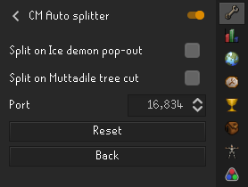

# Autosplitter for LiveSplit for Cox and CM

Sends a split on raid start, room cleared and floor change for Cox Challenge Mode.
Also has a toggle to only split on floor finish, to be useable for regular chambers.

Using this plugin requires the LiveSplit program with the LiveSplit server component.

Installation and setup guide can be found here:

[LiveSplit](https://livesplit.org/downloads/)

[LiveSplit Server](https://github.com/LiveSplit/LiveSplit.Server)

## How to use
Download LiveSplit and the LiveSplit server component.

Turn the plugin on and make sure the port in the plugin settings match your LiveSplit server port.
    

Start LiveSplit and start the LiveSplit server (right click LS -> control -> start server).
Make sure to add the LS server to your layout, otherwise you won't see "start server" under control.

Open the sidebar and click "Connect".
If the status turns green it means you have a connection to your LiveSplit server.
If it stays red something went wrong, most likely you did not start the LiveSplit server
or you have mismatching ports in the plugin settings and the LiveSplit server settings.

If your status is green you are good to go.

## Templates
Layout and splits templates for LiveSplit can be found in [LiveSplit templates](https://github.com/SkyBouncer/cmAutoSplitter/tree/master/LiveSplit%20templates)

## Splits
The plugins sends a split on the following:

- Raid start
- Tekton
- Crabs
- Ice Demon (Ice pop optional)
- Shamans
- Upper floor
- Vanguards
- Thieving
- Vespula
- Rope
- Middle floor
- Guardians
- Vasa
- Mystics
- Muttadile (Tree cut optional)
- Lower floor
- Olm P1
- Olm P2
- Olm P3
- Done
